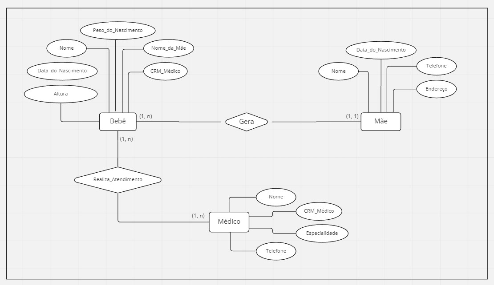

# Exercise 1 - Data Modeling

###### Activity proposed by the Atlântico Academy Bootcamp program - Cycle 3.

## 📝 Exercise-1:
###### Develop the Entity Relationship Diagram for the following.

##### 🔷 1.1 A student performs several jobs. An assignment is carried out by one or more students.

| Student Diagram  
| :---:    
|   

## 📝 Exercise-2:

##### A maternity hospital wants to computerize its operations. When a baby is born, some information is stored about it, such as: name, date of birth, weight of birth, height, the mother of this baby and the doctor who delivered the baby. For mothers, the nursery also wants to keep track, storing information such as: name, address, telephone and date of birth. For physicians, it is important to know: CRM, name, cell phone and specialty.
 
##### 🔷 2.1 Highlight the entities you identify in the text above.

A maternity hospital wants to computerize its operations. When a ==baby== is born, some information is stored about it, such as: name, date of birth, weight of birth, height, the ==mother== of this baby and the ==doctor== who delivered the baby. For mothers, the nursery also wants to keep track, storing information such as: name, address, telephone and date of birth. For doctors, it is important to know: CRM, name, cell phone and specialty.
 

##### 🔷 2.2 List the entities you highlighted.
   
* Baby 
* Mother
* Doctor
 

##### 🔷 2.3 List the relationships between the entities.

| Entities |Relationships | 
|   :---:  |  :---:       |   
| Baby and Mother | Gera  |
| Baby and Doctor |Realiza_Atendimento|
 

##### 🔷 2.4 Create the Entity Relationship model from exercise 2.

| Maternity Hospital Diagram  
| :---:   
|  

## 📝 Exercise-3:
##### 🔷Create an Entity-Relationship diagram.

###### Your diagram should represent appointment scheduling data at a clinic doctor. Sketch how data relating to patients, doctors and  to queries.

|  Medical Clinic Diagram  
| :---:   
|  

## 📝 Exercise-4:
##### 🔷Create a text description, in which you explain in all the details that you can see in the diagram in the image below.

| Movies Diagram 
| :---:   
|  

###### Description:

>There is an artist entity that has the following attributes: artist name, date of birth and nationality. Where, artist's name and date of birth are key attributes of the entity. This entity has some relationships with the movie entity. These relationships are: directing, writing or acting in a given film.

> The movie entity has the attributes: title, year and duration, where title and year are key attributes. A movie has a disclosure relationship with the trailer entity. The trailer entity has a disclosure date as an attribute. Between film and trailer there is a relationship of existential dependence.

>* Entities: artist, film and trailer;
>* Relationship: directs, writes, acts and disseminates;
>* Restrictions: There is an integrity restriction based on the entities' primary keys (artist's name, date of birth, title and year), in addition to an existential dependence restriction on the relationship between film and trailer (disclose, because a trailer will only exist when there is a movie).

## 📝 Exercise-5:

##### 🔷 Consider a BUY_CATALOG database, where the employees receive pieces orders from customers. The requirements of data is summarized as follows:
 

| Requirements | 
|   :---  |  
| 1. The company that sells by catalog has employees, each one identified by unique employee number. Employees also have a name, surname and zip code.
| 2. Each company's customer is identified by a customer number exclusive. They also have first name, last name and zip code.
| 3. Each part sold by the company is identified by a part number exclusive. Parts also have part name, price and quantity in stock.
| 4. Each order placed by a customer is received by an employee and have a unique order number. Each order contains quantities specified of one or more parts. Each order has a due date. Receipt, as well as an expected delivery date. the delivery date real is also recorded.
 
##### 🔷 Create an Entity-Relationship diagram for the database of catalog shopping.

|  BUY_CATALOG Diagram 
| :---:   
|  

## 🤖 Technologies

[Miro](https://miro.com/pt/) - Documentation is available [here](https://developers.miro.com/).
 

#####💻 Developer by [Fernanda Costa](https://github.com/fernandacostads) and [Ivna Feitosa](https://github.com/IvnaFeitosa).

[👉 Click here to access other activities of this project.](https://github.com/fernandacostads/atlantico-academy-bootcamp)