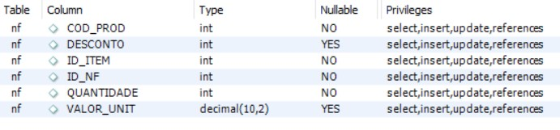
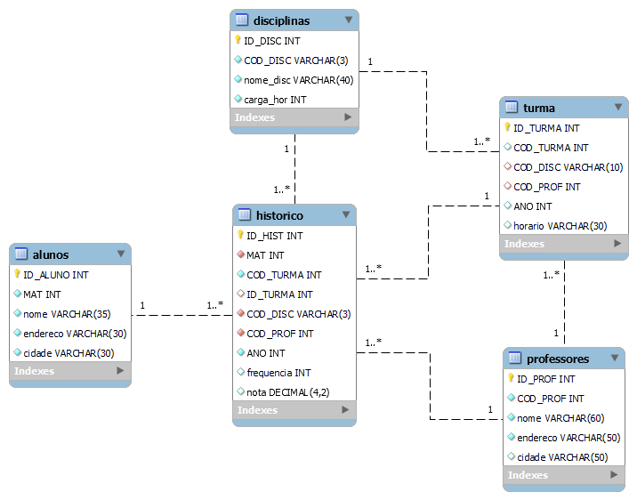

# Exercise 2 - SQL

Activity proposed by the Atlântico Academy Bootcamp program - Cycle 3.

## 📝 Exercise-1: Activity NF

The first question consisted of creating a table called NF, followed by a series of queries. The queries can be viewed in the exercise-1 file.

> NF Table.

## 📝 Exercise-2: Activity University

The second issue consisted of creating a database called the University. Then the database was populated with some data and some queries were carried out on this database.The queries can be viewed in the exercise-2 file.

> UML Diagram of a University Database.

## 🤖 Technologies

> - MySQL Workbench

💻 Developer by [Fernanda Costa](https:///github.com/fernandacostads) and [Ivna Feitosa](https:///github.com/IvnaFeitosa).

[👉 Clique aqui para acessar outras atividades desse projeto](https:///github.com/fernandacostads/atlantico-academy-bootcamp)